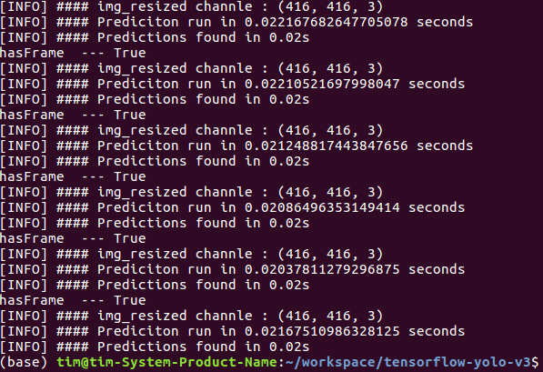

## Usage
python demo_cam.py
- 

## py files
- config.py, configure file
- utils.py, some methods that use to run yolov3
- yolo_v3.py, architecture of yolov3
- yolo_v3_tiny.py, architecture of tiny yolov3
- demo_cam.py, run the yolov3 pb model to predcit the input of camera
