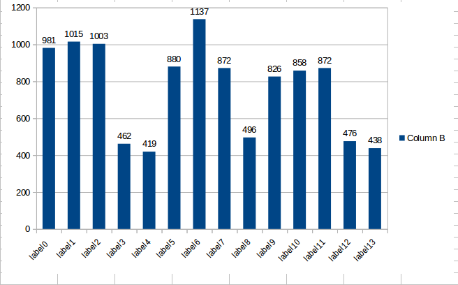
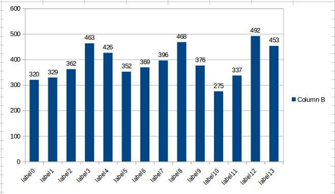
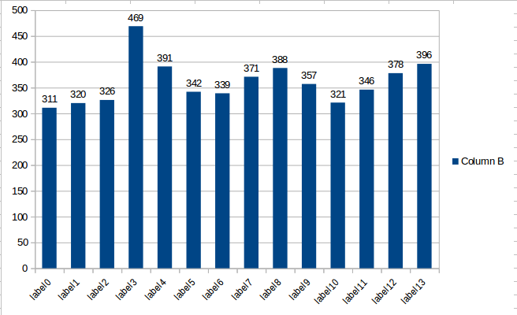

备注：数据备份在移动硬盘的路径： /media/ares2/ext_disk/0000_dove_dataset_bak
```
-0000_dove_dataset_bak
|-train
|-val
|-test
```
## 数据的改动(8th training)

### 统计样本分布的脚本：compute-labels-name.py
- 使用方法
```
1. 新建一个tmp临时文件夹，然后依次从train,val,test中复制需要的图片文件进去，然后执行以下命令以获得train,val,test中所有图片的路径
find `pwd`/ -name "*jpg" > train8.txt
find `pwd`/ -name "*jpg" > val8.txt
find `pwd`/ -name "*jpg" > test8.txt

2. 把compute-labels-name.py跟train8.txt,val8.txt,test8.txt放一起
vi compute-labels-name.py，修改如下：
train_filename =  "train8.txt"
val_filename = "val8.txt"
test_filename = "test8.txt"
执行脚本，python compute-labels-name.py
输出如下：
train8 :
all picture is  3100 (图片数量)
label0 = 981 (bbx 数量)
label1 = 1015
label2 = 1003
label3 = 462
label4 = 419
label5 = 880
label6 = 1137
label7 = 872
label8 = 496
label9 = 826
label10 = 858
label11 = 872
label12 = 476
label13 = 438
label14 = 0

val8 :
all picture is  2100
label0 = 320
label1 = 329
label2 = 362
label3 = 463
label4 = 426
label5 = 352
label6 = 369
label7 = 396
label8 = 468
label9 = 376
label10 = 275
label11 = 337
label12 = 492
label13 = 453
label14 = 0

test8 :
all picture is  2063
label0 = 311
label1 = 320
label2 = 326
label3 = 469
label4 = 391
label5 = 342
label6 = 339
label7 = 371
label8 = 388
label9 = 357
label10 = 321
label11 = 346
label12 = 378
label13 = 396
label14 = 0

```
### 训练数据
- training data: train/dove14_fifth_before_after-img100 + train/dove14-fifth-train-data-img100 + train/dove14-fifth-train-data-img200 + train/label3_4_8_12_13_train_img500
- 训练数据bbx分布图
-  

### 验证数据
- val data: val/dove14_fifth_before_after_img200 + val/dove14_fifth_before_after_img500 + val/label3_4_8_12_13_val_img500
- 验证数据bbx分布图
-  

### 测试数据
- test data: test/dove14_fifth_before_after_img300 + test/dove14_fifth_before_after_img400 + test/dove14_fifth_before_after_label3481213_img500
- 测试数据bbx分布图
-  

## 训练过程
### 训练前准备.data, .cfg, .names, .weights

- cholo.data 
```
classes=14
train=data/cholo/14dove/eighth_train/train8.txt
valid=data/cholo/14dove/eighth_train/val8.txt
names=data/cholo/14dove/14dove.names
backup=data/cholo/14dove/eighth_train/

```

- 14dove.names
```
cream_hazelnut
cream_berry
cream_cherry
yida_cool_lemon 
box_yogurt_mango 
white_strawberry
cookies_lemon
yogurt_cranberry
box_cookies_matcha
cookies_matcha
yogurt_mango
white_passionfruit
yida_cool_litchi
box_white_strawberry
```

- yolov3-gaussian-cholo.cfg
```
[net]
# Testing
#batch=1
#subdivisions=1
# Training
batch=64
subdivisions=32
width=608
height=608
channels=3
momentum=0.9
decay=0.005
angle=0
saturation = 1.5
exposure = 1.5
#hue=.1

learning_rate=0.0001
burn_in=1000
max_batches = 40000
policy=steps
steps=16000,22000
scales=.1,.1
# max_epochs = 300

[convolutional]
batch_normalize=1
filters=32
size=3
stride=1
pad=1
activation=leaky

# Downsample

[convolutional]
batch_normalize=1
filters=64
size=3
stride=2
pad=1
activation=leaky

[convolutional]
batch_normalize=1
filters=32
size=1
stride=1
pad=1
activation=leaky

[convolutional]
batch_normalize=1
filters=64
size=3
stride=1
pad=1
activation=leaky

[shortcut]
from=-3
activation=linear

# Downsample

[convolutional]
batch_normalize=1
filters=128
size=3
stride=2
pad=1
activation=leaky

[convolutional]
batch_normalize=1
filters=64
size=1
stride=1
pad=1
activation=leaky

[convolutional]
batch_normalize=1
filters=128
size=3
stride=1
pad=1
activation=leaky

[shortcut]
from=-3
activation=linear

[convolutional]
batch_normalize=1
filters=64
size=1
stride=1
pad=1
activation=leaky

[convolutional]
batch_normalize=1
filters=128
size=3
stride=1
pad=1
activation=leaky

[shortcut]
from=-3
activation=linear

# Downsample

[convolutional]
batch_normalize=1
filters=256
size=3
stride=2
pad=1
activation=leaky

[convolutional]
batch_normalize=1
filters=128
size=1
stride=1
pad=1
activation=leaky

[convolutional]
batch_normalize=1
filters=256
size=3
stride=1
pad=1
activation=leaky

[shortcut]
from=-3
activation=linear

[convolutional]
batch_normalize=1
filters=128
size=1
stride=1
pad=1
activation=leaky

[convolutional]
batch_normalize=1
filters=256
size=3
stride=1
pad=1
activation=leaky

[shortcut]
from=-3
activation=linear

[convolutional]
batch_normalize=1
filters=128
size=1
stride=1
pad=1
activation=leaky

[convolutional]
batch_normalize=1
filters=256
size=3
stride=1
pad=1
activation=leaky

[shortcut]
from=-3
activation=linear

[convolutional]
batch_normalize=1
filters=128
size=1
stride=1
pad=1
activation=leaky

[convolutional]
batch_normalize=1
filters=256
size=3
stride=1
pad=1
activation=leaky

[shortcut]
from=-3
activation=linear


[convolutional]
batch_normalize=1
filters=128
size=1
stride=1
pad=1
activation=leaky

[convolutional]
batch_normalize=1
filters=256
size=3
stride=1
pad=1
activation=leaky

[shortcut]
from=-3
activation=linear

[convolutional]
batch_normalize=1
filters=128
size=1
stride=1
pad=1
activation=leaky

[convolutional]
batch_normalize=1
filters=256
size=3
stride=1
pad=1
activation=leaky

[shortcut]
from=-3
activation=linear

[convolutional]
batch_normalize=1
filters=128
size=1
stride=1
pad=1
activation=leaky

[convolutional]
batch_normalize=1
filters=256
size=3
stride=1
pad=1
activation=leaky

[shortcut]
from=-3
activation=linear

[convolutional]
batch_normalize=1
filters=128
size=1
stride=1
pad=1
activation=leaky

[convolutional]
batch_normalize=1
filters=256
size=3
stride=1
pad=1
activation=leaky

[shortcut]
from=-3
activation=linear

# Downsample

[convolutional]
batch_normalize=1
filters=512
size=3
stride=2
pad=1
activation=leaky

[convolutional]
batch_normalize=1
filters=256
size=1
stride=1
pad=1
activation=leaky

[convolutional]
batch_normalize=1
filters=512
size=3
stride=1
pad=1
activation=leaky

[shortcut]
from=-3
activation=linear


[convolutional]
batch_normalize=1
filters=256
size=1
stride=1
pad=1
activation=leaky

[convolutional]
batch_normalize=1
filters=512
size=3
stride=1
pad=1
activation=leaky

[shortcut]
from=-3
activation=linear


[convolutional]
batch_normalize=1
filters=256
size=1
stride=1
pad=1
activation=leaky

[convolutional]
batch_normalize=1
filters=512
size=3
stride=1
pad=1
activation=leaky

[shortcut]
from=-3
activation=linear


[convolutional]
batch_normalize=1
filters=256
size=1
stride=1
pad=1
activation=leaky

[convolutional]
batch_normalize=1
filters=512
size=3
stride=1
pad=1
activation=leaky

[shortcut]
from=-3
activation=linear

[convolutional]
batch_normalize=1
filters=256
size=1
stride=1
pad=1
activation=leaky

[convolutional]
batch_normalize=1
filters=512
size=3
stride=1
pad=1
activation=leaky

[shortcut]
from=-3
activation=linear


[convolutional]
batch_normalize=1
filters=256
size=1
stride=1
pad=1
activation=leaky

[convolutional]
batch_normalize=1
filters=512
size=3
stride=1
pad=1
activation=leaky

[shortcut]
from=-3
activation=linear


[convolutional]
batch_normalize=1
filters=256
size=1
stride=1
pad=1
activation=leaky

[convolutional]
batch_normalize=1
filters=512
size=3
stride=1
pad=1
activation=leaky

[shortcut]
from=-3
activation=linear

[convolutional]
batch_normalize=1
filters=256
size=1
stride=1
pad=1
activation=leaky

[convolutional]
batch_normalize=1
filters=512
size=3
stride=1
pad=1
activation=leaky

[shortcut]
from=-3
activation=linear

# Downsample

[convolutional]
batch_normalize=1
filters=1024
size=3
stride=2
pad=1
activation=leaky

[convolutional]
batch_normalize=1
filters=512
size=1
stride=1
pad=1
activation=leaky

[convolutional]
batch_normalize=1
filters=1024
size=3
stride=1
pad=1
activation=leaky

[shortcut]
from=-3
activation=linear

[convolutional]
batch_normalize=1
filters=512
size=1
stride=1
pad=1
activation=leaky

[convolutional]
batch_normalize=1
filters=1024
size=3
stride=1
pad=1
activation=leaky

[shortcut]
from=-3
activation=linear

[convolutional]
batch_normalize=1
filters=512
size=1
stride=1
pad=1
activation=leaky

[convolutional]
batch_normalize=1
filters=1024
size=3
stride=1
pad=1
activation=leaky

[shortcut]
from=-3
activation=linear

[convolutional]
batch_normalize=1
filters=512
size=1
stride=1
pad=1
activation=leaky

[convolutional]
batch_normalize=1
filters=1024
size=3
stride=1
pad=1
activation=leaky

[shortcut]
from=-3
activation=linear

######################

[convolutional]
batch_normalize=1
filters=512
size=1
stride=1
pad=1
activation=leaky

[convolutional]
batch_normalize=1
size=3
stride=1
pad=1
filters=1024
activation=leaky

[convolutional]
batch_normalize=1
filters=512
size=1
stride=1
pad=1
activation=leaky

[convolutional]
batch_normalize=1
size=3
stride=1
pad=1
filters=1024
activation=leaky

[convolutional]
batch_normalize=1
filters=512
size=1
stride=1
pad=1
activation=leaky

[convolutional]
batch_normalize=1
size=3
stride=1
pad=1
filters=1024
activation=leaky

[convolutional]
size=1
stride=1
pad=1
filters=69
activation=linear


[Gaussian_yolo]
mask = 6,7,8
#anchors = 36,137 ,22,102, 28,117, 87,79, 55,101, 74,48, 51,183, 25,55, 34,84
anchors = 40,33 ,22,68, 42,63, 32,113, 76,53, 52,92, 84,89, 65,136, 103,171
classes=14
num=9
jitter=.3
ignore_thresh = .5
truth_thresh = 1
iou_thresh=0.213
uc_normalizer=1.0
cls_normalizer=1.0
iou_normalizer=0.5
iou_loss=giou
scale_x_y=1.0
random=1


[route]
layers = -4

[convolutional]
batch_normalize=1
filters=256
size=1
stride=1
pad=1
activation=leaky

[upsample]
stride=2

[route]
layers = -1, 61
i


[convolutional]
batch_normalize=1
filters=256
size=1
stride=1
pad=1
activation=leaky

[convolutional]
batch_normalize=1
size=3
stride=1
pad=1
filters=512
activation=leaky

[convolutional]
batch_normalize=1
filters=256
size=1
stride=1
pad=1
activation=leaky

[convolutional]
batch_normalize=1
size=3
stride=1
pad=1
filters=512
activation=leaky

[convolutional]
batch_normalize=1
filters=256
size=1
stride=1
pad=1
activation=leaky

[convolutional]
batch_normalize=1
size=3
stride=1
pad=1
filters=512
activation=leaky

[convolutional]
size=1
stride=1
pad=1
filters=69
activation=linear


[Gaussian_yolo]
mask = 3,4,5
#anchors = 36,137 ,22,102, 28,117, 87,79, 55,101, 74,48, 51,183, 25,55, 34,84
anchors = 40,33 ,22,68, 42,63, 32,113, 76,53, 52,92, 84,89, 65,136, 103,171
classes=14
num=9
jitter=.3
ignore_thresh = .5
truth_thresh = 1
iou_thresh=0.213
uc_normalizer=1.0
cls_normalizer=1.0
iou_normalizer=0.5
iou_loss=giou
scale_x_y=1.0
random=1


[route]
layers = -4

[convolutional]
batch_normalize=1
filters=128
size=1
stride=1
pad=1
activation=leaky

[upsample]
stride=2

[route]
layers = -1, 36


[convolutional]
batch_normalize=1
filters=128
size=1
stride=1
pad=1
activation=leaky

[convolutional]
batch_normalize=1
size=3
stride=1
pad=1
filters=256
activation=leaky

[convolutional]
batch_normalize=1
filters=128
size=1
stride=1
pad=1
activation=leaky

[convolutional]
batch_normalize=1
size=3
stride=1
pad=1
filters=256
activation=leaky

[convolutional]
batch_normalize=1
filters=128
size=1
stride=1
pad=1
activation=leaky

[convolutional]
batch_normalize=1
size=3
stride=1
pad=1
filters=256
activation=leaky

[convolutional]
size=1
stride=1
pad=1
filters=69
activation=linear


[Gaussian_yolo]
mask = 0,1,2
#anchors = 36,137 ,22,102, 28,117, 87,79, 55,101, 74,48, 51,183, 25,55, 34,84
anchors = 40,33 ,22,68, 42,63, 32,113, 76,53, 52,92, 84,89, 65,136, 103,171
classes=14
num=9
jitter=.3
ignore_thresh = .5
truth_thresh = 1
iou_thresh=0.213
uc_normalizer=1.0
cls_normalizer=1.0
iou_normalizer=0.5
iou_loss=giou
scale_x_y=1.0
random=1
```

### 训练命令
- 进入darknet根目录下，输入以下命令开始训练
```
./darknet detector train data/cholo/14dove/eighth_train/cholo.data data/cholo/14dove/eighth_train/yolov3-gaussian-cholo.cfg data/cholo/14dove/eighth_train/yolov3-gaussian-cholo_15000.weights -map
```

## 训练结果

## 总结

